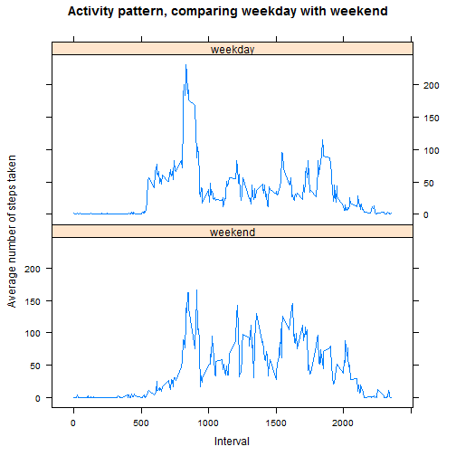

## Loading and preprocessing the data


## What is mean total number of steps taken per day?

```r
data <- read.csv("activity/activity.csv")

complete <- data[complete.cases(data),]

days <- split(complete, complete$date, drop=TRUE)

totalStepsPerDay <- sapply(days, function(day) { return (sum(day$steps)) } )
```


```r
hist(totalStepsPerDay,
     main="Total steps per day",
     xlab="Steps")
```

 

## What is mean total number of steps taken per day?
The mean total number of steps taken per day is
10766.
The median total number of steps taken per day is
10765.


## What is the average daily activity pattern?


```r
intervals <- split(complete, complete$interval)

meanStepsPerInterval <- sapply(intervals, function(i) { return (mean(i$steps)) } )
```


```r
plot(meanStepsPerInterval,
     type="l",
     main="Daily Activity Pattern",
     ylab="Steps",
     xlab="Interval")
```

 

```r
highestInterval = which.max(meanStepsPerInterval)
highestValue = meanStepsPerInterval[highestInterval]
```

The highest mean number of steps (of value 206.1698113) occurs at five-minute interval 104.

## Inputing missing values
The total number of rows with missing values is
2304.


```r
# Estimate the missing values
estimData = data
for (r in 1:nrow(estimData)) {
  if (is.na(estimData[r, 'steps'])) {
    interval = estimData[r, 'interval']
    index = which(names(meanStepsPerInterval) == as.character(interval))
    replacement = meanStepsPerInterval[index]
    estimData[r, 'steps'] = replacement
  }
}
```


```r
estimDays <- split(estimData, estimData$date, drop=TRUE)

estimTotalStepsPerDay <- sapply(estimDays, function(day) { return (sum(day$steps)) } )
```


```r
hist(estimTotalStepsPerDay,
     main="Total steps per day (with missing values estimated)",
     xlab="Steps")
```

 

With missing values filled in with estimates,
the mean total number of steps taken per day is
10766.
and the median total number of steps taken per day is
10766.


```r
# What is the impact of adding estimates for the missing data?
# Returns: the percentage difference (roughly speaking)
Impact <- function (before, after) {
  return (200 * (before - after) / (before + after))
}

impactMean = Impact(mean(totalStepsPerDay), mean(estimTotalStepsPerDay))

impactMedian = Impact(median(totalStepsPerDay), median(estimTotalStepsPerDay))
```

The mean   changed by 0 percent.
The meidan changed by -0.0110415 percent.
So we conclude that estimating the missing values did not significantly affect the results.

## Are there differences in activity patterns between weekdays and weekends?


```r
estimData$we <- factor( weekdays(as.Date(estimData$date)) %in% c("Saturday", "Sunday"), labels=c("weekday", "weekend") )
```


```r
estimWeData = estimData[estimData$we=="weekend", ]
estimWeIntervals <- split(estimWeData, estimWeData$interval)

meanWeekend <- sapply(estimWeIntervals, function(i) { return (mean(i$steps)) } )

estimWdData = estimData[estimData$we=="weekday", ]
estimWdIntervals <- split(estimWdData, estimWdData$interval)

meanWeekday <- sapply(estimWdIntervals, function(i) { return (mean(i$steps)) } )

combined = data.frame(average=meanWeekend, interval=names(meanWeekend), we=as.factor("weekend"))
combined = rbind(combined, data.frame(average=meanWeekday, interval=names(meanWeekday), we=as.factor("weekday")))

##ord = combined[order(as.integer(as.character(combined$interval))), ]

library(lattice)
xyplot(average ~ as.integer(as.character(interval)) | we,
       data=combined,
       type="l",
       layout=c(1,2),
       main="Average number of steps taken, comparing weekday with weekend",
       ylab="Average number of steps taken",
       xlab="Interval")
```

 


